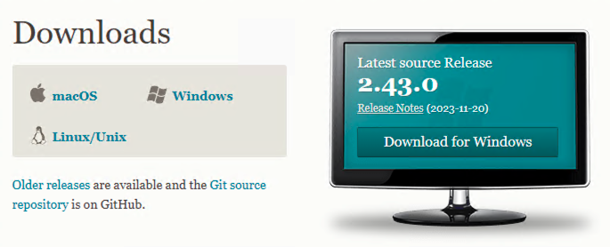
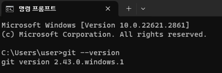

# Git

## 윈도우 버전 설치
깃 프로그램 다운로드  
https://git-scm.com/downloads  
  

ext 파일 실행하여 인스톨(기본설정 그대로)  

깃 설치 확인
터미널(명령프롬프트)에서 아래 명령어 입력   
`git --version`

## Mac 버전 설치(With Homebrew)
https://formulae.brew.sh/formula/git  
터미널에서 아래 명령어 입력  
`brew install git`

## Git 명령어
### Git 로컬저장소 생성
- 버전관리하려는 폴더에서 Git Bash 실행
- `$ git init` 실행
- 해당 폴더에 .git 폴더가 생성(숨김폴더이기 때문에 안보일 때는 보기 설정을 변경)
- .git directory에는 프로젝트의 메타데이터와 각종 정보가 저장
 
### Git Staging Area에 커밋할 스냅샷 생성(수정/생성된 파일 추가)
- `$ git add .`, `$ git add *`: 수정, 생성된 모든파일에 대해 추가
- `$ git add <fileName>, ...`: 수정된 파일 개개별로 추가

### 파일의 수정 내역을 로컬 저장소에 커밋
- `$ git commit -m "message"`

### 로컬 저장소의 상태 확인
- `$ git status`