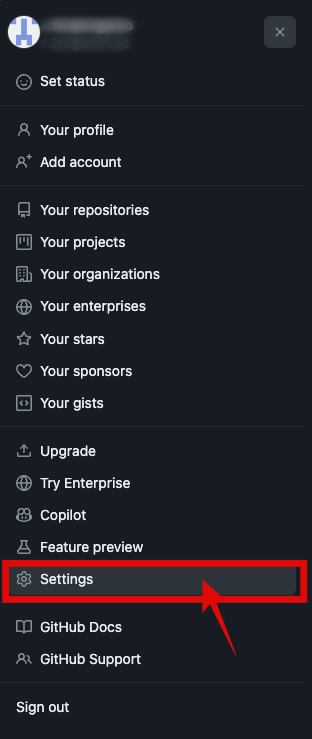
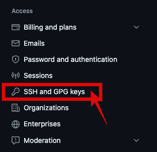
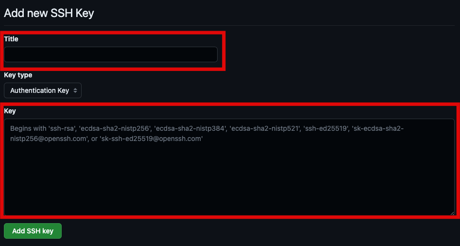

# Git과 GitHub

## What

**사전적 정의**  

- [ ] Git: 무료 오픈소스 분산 버전 관리 시스템  
- [ ] GitHub: 깃 저장소 호스팅을 지원하는 웹 서비스

## Who

- [ ] 개발과 관련된 모든 직군 또는 개발을 하는 모든 사람  

## When

- [ ] Git: 혼자서 개발을 진행할 때  
- [ ] GitHub: 여러사람이 동시에 개발을 진행할 때  

## Where

- [ ] Git: 본인의 PC, 즉 로컬 환경  
- [ ] GitHub: PC가 있고, 인테넷이 연결되는 환경 어디든

## Why

- [ ] Git: 여러 이슈를 동시에 해결할 때 버전을 관리하기 위해  
- [ ] GitHub: 다른 개발자와 협업을 위해  

## How

### Git 설치  

**Windows**  

- [ ] 다운로드: https://git-scm.com/downloads  
- [ ] .exe 파일 실행
- [ ] 기본 설정으로 설치 진행
- [ ] 설치 완료 확인
  - [ ] 터미널 실행: Win + r -> cmd | 명령프롬프트 검색  
  - [ ] 다음 명령어 입력하여 버전이 나오면 정상적으로 설치 완료 `git --version`  

**Mac(with Homebrew)**  
- [ ] 직접 다운로드: https://git-scm.com/downloads  
- [ ] homebrew를 통한 설치: `brew install git`  

### Git 자주 사용하는 명령어
홑화살괄호(`<>`) 안에 내용은 상황에 맞게 변경하여 사용
- [ ] `git init`
- [ ] `git clone <원격 깃 저장소 주소>`
- [ ] `git status`
- [ ] `git add .`
- [ ] `git add <파일경로>`
- [ ] `git commit -m "commit message"`
- [ ] `git push origin <브랜치>`
- [ ] `git pull origin <브랜치>`
- [ ] `git fetch`
- [ ] `git fetch --all --prune`
- [ ] `git checkout -b <브랜치>`
- [ ] `git checkout <브랜치>`
- [ ] `git branch -d <브랜치>`
- [ ] `git switch <브랜치>`
- [ ] `git rebase <브랜치>`
- [ ] `git rebase -i <HEAD~2>`
- [ ] `git merge <브랜치>`
- [ ] `git merge --squash <브랜치>`
- [ ] `git cherry-pick <커밋 해시코드>`
- [ ] `git log --graph --all`
- [ ] `git reflog`
- [ ] `git revert <브랜치>`
- [ ] `git reset <HEAD^>`
- [ ] `git stash`
- [ ] `git stash list`
- [ ] `git stash apply <@stash{0}>`
- [ ] `git stash drop <@stash{0}>`

### Git gui 툴 사용하기

**gitk**
- [ ] 윈도우 용은 git 설치하면 자동으로 설치됨
- [ ] 맥용 터미널에서 설치
  - [ ] `brew update`
  - [ ] `brew install git-gui`
- [ ] gitk 실행: `gitk --all`

**git kraken**  
- [ ] 설치용 프로그램 다운로드(윈도우, 맥): https://www.gitkraken.com/
- [ ] 맥 터미널에서 설치: `brew install --cask gitkraken`

**intellij**   
git log
- [ ] View > Tool Windows > Git
- [ ] 단축키
  - [ ] 윈도우: alt + 9
  - [ ] 맥: cmd + 9

git commit
- [ ] View > Tool Windows > Git
- [ ] 단축키
  - [ ] 윈도우: alt + 0
  - [ ] 맥: cmd + 0

### GitHub과 연동하기

**PC ssh keygen 생성**

- [ ] key 생성
  - 터미널 실행(윈도우: 명령프롬프트)
  - home으로 이동 
    - `cd ~`
  - 키 생성 명령어 실행
    - `ssh-keygen`
  - 퍼블릭 키 복사
    - mac: `cat ~/.ssh/id_rsa.pub` | pbcopy
    - 윈도우: 메모장으로 열어서 내용 복사
- [ ] 깃헙에 ssh 키 등록  
  - 깃헙 우측 상단 Avatar 클릭  
      
  - Settings 클릭  
    
  - 좌측 메뉴에서 SSH and GPG keys 클릭  
    
  - New SSH key 클릭  
    
  - Key 영역에 복사해 두었던 id_rsa.pub 전체 내용을 붙여넣고 `Add SSH key` 클릭
    

### 같이 알아보면 좋은 것

**git branch 전략(git workflow)**  
**git branch 네이밍 컨벤션**  
**코드 리뷰**  
**[GitLab](https://about.gitlab.com/free-trial/devsecops/?utm_medium=cpc&utm_source=google&utm_campaign=eg_apac_dmp_x_x_en_brand_apac_pr_rsa_br_exact_free-trial&utm_content=free-trial&_bt=363144592744&_bk=gitlab&_bm=e&_bn=g&_bg=75085129886&gad_source=1&gclid=CjwKCAiA5L2tBhBTEiwAdSxJXwJxdEI-X3cnBXiLVFiqtT4pGKmLxwopjmpF8Lxhaxd4RnkvtfPsZBoCEisQAvD_BwE) / [bitbucket](https://bitbucket.org/product?&aceid=&adposition=&adgroup=146989386670&campaign=18815940604&creative=632894031594&device=c&keyword=bitbucket&matchtype=e&network=g&placement=&ds_kids=p74128740641&ds_e=GOOGLE&ds_eid=700000001551985&ds_e1=GOOGLE&gad_source=1&acs_info=ZmluYWxfdXJsOiAiaHR0cHM6Ly9iaXRidWNrZXQub3JnL3Byb2R1Y3QiCg&gclid=CjwKCAiA5L2tBhBTEiwAdSxJXzOgKlFeSbp1yM7fS385BubBj-GWTHTTQBvIgahGg6arTHz3rrwUnRoCtWYQAvD_BwE&gclsrc=aw.ds)**  

  
